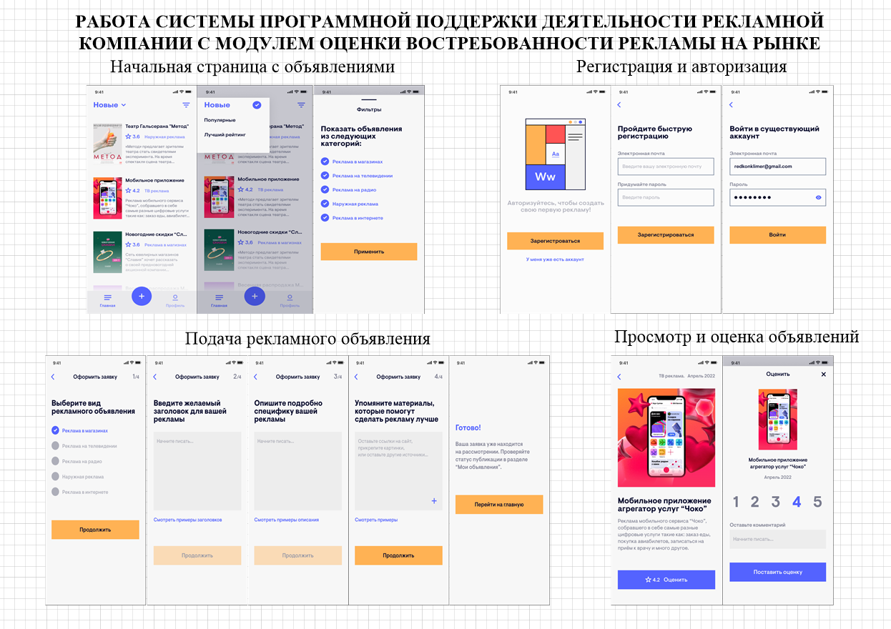

по сути любой чел скачивает приложуху и может без авторизации оценивать рекламные объявки. если нужно подать объявление, то уже нужна регистрация. и только тогда можно подать его, посмотреть свои все, посмотреть историю своих оценок(но это вообще не обязательно), продолжить оформление какого-то черновика, посмотреть политики.
от админа просто проверка объяв и их размещение, если прошло проверку. если нет, можно либо удалить, либо отправить обратно на доработку.

а, да. кто разместил рекламу, видит оценки(с комментами, если есть). и показывается средняя оценочка.

